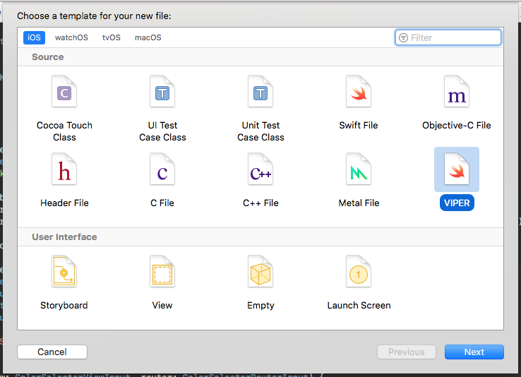

# VIPER Template

Шаблон для Xcode для генерации VIPER-модуля

## Как добавить шаблон в Xcode

### Добавление и обновление шаблона вручную

#### Установка "с нуля"
- Скачайте файлы из репозитория
- Создайте нужную директорию командой `mkdir ~/Library/Developer/Xcode/Templates | mkdir ~/Library/Developer/Xcode/Templates/File\ Templates | mkdir ~/Library/Developer/Xcode/Templates/File\ Templates/Custom\ Templates | mkdir ~/Library/Developer/Xcode/Templates/File\ Templates/Custom\ Templates/Source`
- В свежесозданную директорию `Source` переместите файл `VIPER.xctemplate`

#### Обновление
- Скачайте файлы из репозитория
- Замените файл `VIPER.xctemplate` в директории `~/Library/Developer/Xcode/Templates/File\ Templates/Custom\ Templates/Source`

### Добавление и обновление шаблона с помощью скрипта
- Скачайте файлы из репозитория
- В папке git репозитория вызвать `./DeployTemplateScript.sh`

## Как использовать шаблон в Xcode
- Запустите Xcode
- Откройте диалоговое окно создания нового файла (`File > New > File` или `⌘N` )
- Найдите секцию `Source` и выберите шаблон `VIPER`
- Введите название вашего VIPER-модуля и выберите нужные `Target Membership`

